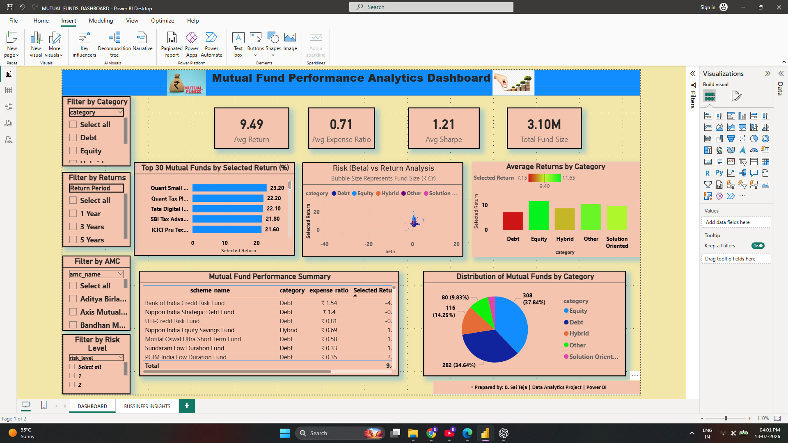
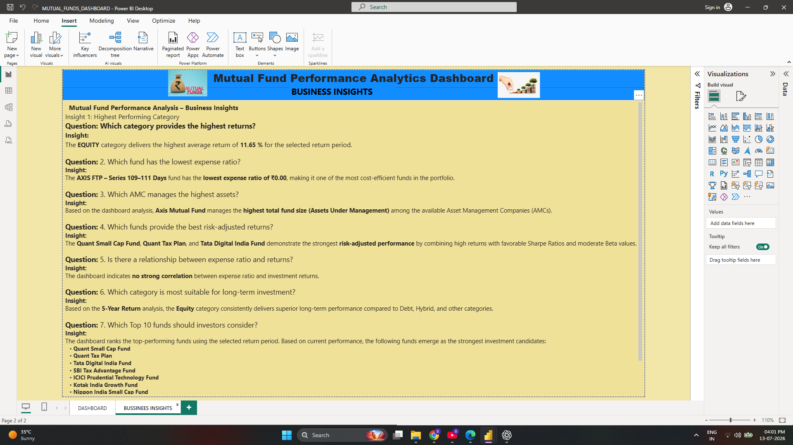

# Mutual Funds Analytics Dashboard 📊
## Overview

The Mutual Funds Analytics Dashboard is an interactive Power BI project developed to analyze mutual fund performance, risk, returns, and fund categories. The dashboard leverages Power Query for data transformation and DAX for calculations to deliver meaningful insights through interactive visualizations and KPI cards. It helps investors and analysts compare fund performance, identify top-performing categories, and support data-driven investment decisions.

## Features
- Executive Summary Dashboard
- Performance Analysis
- Category-wise Returns
- Top Performing Funds
- Interactive Filters
- KPI Cards
- Business Insights

## Tools Used
- Power BI
- Power Query
- DAX
- Excel
- Python (Data Cleaning)

## Project Structure

```
Dashboard/
Dataset/
Images/
Notebook/
Report/
README.md
```
## Dashboard Preview

### Executive Dashboard



### Performance Dashboard



## Business Insights

- Equity funds generated the highest average returns.
- Debt funds provided lower risk with stable performance.
- Top-performing funds consistently outperformed the average.
- Interactive filters allow detailed category-wise analysis.
- KPI cards provide quick investment performance insights.
- 
## Skills Demonstrated

- Power BI Dashboard Development
- Data Cleaning
- Data Modeling
- DAX Measures
- Power Query
- Business Intelligence
- Data Visualization
## Author

**Saiteja Boothpur**

Aspiring Data Analyst

### Connect with me

- LinkedIn: *(add your LinkedIn URL)*
- GitHub: https://github.com/bsaiteja447


